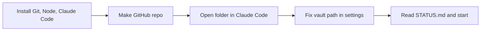

# 🚀 Getting started in Claude Code

> [!summary] In short
> Install 3 tools → put this folder on GitHub → open it in Claude Code → say **"Read STATUS.md and start"**.



## 1. Install (once)
- [ ] **Git**: https://git-scm.com/download/win (defaults are fine)
- [ ] **Node.js LTS**: https://nodejs.org
- [ ] **Claude Code**: the Claude desktop app → Code tab, or the terminal version (https://docs.claude.com/en/docs/claude-code)
- [ ] **GitHub account** (you'll need it for the store anyway)

> [!tip] Check it worked
> In a terminal: `git --version` and `node --version` should both print a version number.

## 2. Make the repo
In a terminal (PowerShell), inside this folder (`lab-kit-repo`):
```powershell
Rename-Item _claude .claude
git init
git add .
git commit -m "Lab Kit v0.3 handoff"
```
Then on github.com → **New repository** → name `lab-kit`, **public** (the store needs public), *no* README → follow the "push an existing repository" lines it shows.

> [!info] Why the rename?
> Claude's settings, skills and rules live in a `.claude` folder. For safety, Claude can't write into `.claude` folders on your computer remotely, so they arrived as `_claude`. Renaming it switches them on.

> [!note] Or let Claude do it
> Open the folder in Claude Code and say *"initialise git and push to a new public GitHub repo called lab-kit"*. It'll ask before pushing.

## 3. Protect your real vault 🔒
> [!warning] Keep Claude out of your real vault
> Your vault's path is personal, so it isn't in the repo. Instead, create `.claude/settings.local.json` (Git ignores this file) with:
> ```json
> { "permissions": { "deny": [ "Read(//c/path/to/your/vault/**)", "Edit(//c/path/to/your/vault/**)" ] } }
> ```
> Replace `c/path/to/your/vault` with the real path, using forward slashes (`C:\Users\you\Vault` → `c/Users/you/Vault`). Or ask Claude to make it on the first run.

## 4. Set up the test vault
1. In the folder, run `npm install` then `npm run dev` (or ask Claude to).
2. In Obsidian: **Open another vault → Open folder as vault → `test-vault`**.
3. Enable community plugins there. Install **Templater** and **Dataview** in the test vault too.

> [!tip] Optional
> The **Hot-Reload** plugin (https://github.com/pjeby/hot-reload) reloads the plugin automatically after each build.

## 5. First prompt
> **Read STATUS.md and start.**

Claude will port the plugin to TypeScript (no visible changes) and then work through **BACKLOG.md**.

## Day to day
| You want to… | Say / do |
|---|---|
| Continue | "Read STATUS.md and continue" |
| Give feedback | Paste the feedback page's **Copy all** → `/feedback` |
| Make a release | `/release` |
| Start a new task | `/clear` first (keeps it fast and cheap) |

> [!warning] Things Claude will always ask you about
> - Pushing to GitHub or making a release
> - Changing text, layout or defaults you didn't ask for
> - Anything touching your real vault (it shouldn't at all)
