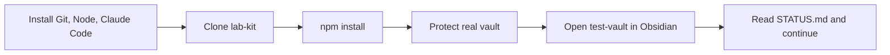

# 🚀 Getting started in Claude Code

> [!summary] In short
> Install 3 tools → clone the repo → protect your real vault → open `test-vault` in Obsidian → say **"Read STATUS.md and continue"**.



## 1. Install (once)
- [ ] **Git**: https://git-scm.com/download/win (defaults are fine)
- [ ] **Node.js LTS**: https://nodejs.org
- [ ] **Claude Code**: the Claude desktop app → Code tab, or the terminal version (https://docs.claude.com/en/docs/claude-code)
- [ ] **GitHub CLI** (optional, for PRs and releases): https://cli.github.com, then `gh auth login`

> [!tip] Check it worked
> In a terminal: `git --version` and `node --version` should both print a version number.

## 2. Get the repo
```powershell
git clone https://github.com/johnsonolly4/lab-kit.git
cd lab-kit
npm install
```
Then open the `lab-kit` folder in Claude Code.

## 3. Protect your real vault 🔒
> [!warning] Keep Claude out of your real vault
> Your vault's path is personal, so it isn't in the repo. Create `.claude/settings.local.json` (Git ignores this file) with:
> ```json
> { "permissions": { "deny": [ "Read(//c/path/to/your/vault/**)", "Edit(//c/path/to/your/vault/**)" ] } }
> ```
> Replace `c/path/to/your/vault` with the real path, using forward slashes (`C:\Users\you\Vault` → `c/Users/you/Vault`). Or ask Claude to make it on the first run.

## 4. Set up the test vault
1. Run `npm run dev` (or ask Claude to). It builds the plugin into `test-vault/.obsidian/plugins/lab-kit/` and rebuilds on every change.
2. In Obsidian: **Open another vault → Open folder as vault → `test-vault`**.
3. Enable community plugins there. Install **Templater** in the test vault too, then turn on **Lab Kit**.
4. Settings → Lab Kit → Built-in kit → **Review update…** installs the templates and scripts into the test vault.

> [!tip] Optional
> The **Hot-Reload** plugin (https://github.com/pjeby/hot-reload) reloads the plugin automatically after each build.

> [!info] What stays local
> Everything in `test-vault/` except `Welcome.md` is ignored by Git: test notes, installed kit files and the built plugin never get committed.

## Day to day
| You want to… | Say / do |
|---|---|
| Continue | "Read STATUS.md and continue" |
| Give feedback | Paste the feedback page's **Copy all** → `/feedback` |
| Make a release | `/release` |
| Start a new task | `/clear` first (keeps it fast and cheap) |

> [!warning] Things Claude will always ask you about
> - Pushing to GitHub or making a release
> - Changing text, layout or defaults you didn't ask for
> - Anything touching your real vault (it shouldn't at all)
