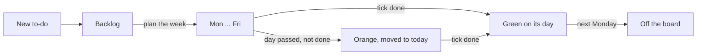
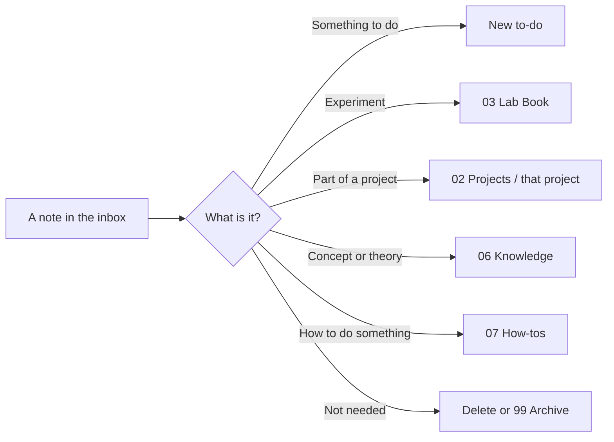

# How my vault works

> [!focus] The whole idea in one minute
> - **Start every day on [[00 Home]].** It shows what matters today and nothing else.
> - **Capture first, sort later.** Anything that pops into your head goes into the inbox with `Ctrl+N`. You sort it on Friday.
> - **Every to-do is a card on the board.** You plan by dragging cards onto days. Tick **done** when it's finished; anything unfinished follows you to the next day.
> - **Experiments and papers move through stages.** The homepage shows the ones that need you.
> - **Fridays tidy, Thursdays report.** Two short routines keep everything from piling up.

## Every day

> [!planning] Morning (2 minutes)
> 1. Open Obsidian. The homepage opens by itself (or press `Alt+H`).
> 2. Look at **This week**. Red *overdue* badges first, then anything tagged *today*. Amber *carried over* = it rolled over from an earlier day.
> 3. Type up to **3 things** into *Today's focus*. Three is the limit on purpose.
> 4. Press **Today's note** (`Alt+D`) if you want somewhere to jot down what happens.

> [!tip] During the day
> | I want to... | Do this |
> |---|---|
> | Note down a thought quickly | `Ctrl+N` or **Quick capture** - it goes to the inbox |
> | Remember to do something | **New to-do** (`Ctrl+Shift+T`) - type it, press Enter, pick a project or press Esc. Started from a project? It picks the project for you. Or press **New** at the top of a day on the board - it lands on that day |
> | Start an experiment | **New lab entry** (`Ctrl+Shift+L`) - it numbers itself and asks for a title |
> | Find anything | **Search** (`Alt+F`) |
> | Make a note for a paper | `Ctrl+P`, then **ZotLit: Create literature note** |
> | Need to order something for the lab | **Add to shopping** - type items, commas between them |
> | Clear the inbox | **Sort inbox** (under *This week*) - takes a minute when it's short |
> | Mark something finished | Click the **circle** on its card on the [[To-do board.base\|To-do board]] - the card turns green. Click again to undo |

> [!summary] End of the day
> - Tick off your focus items, then press **Clear for tomorrow**.
> - Your daily note's *Today in the vault* already lists what you worked on - nothing to write up.

## To-dos

- Every to-do starts in **Backlog**. Drag it onto a day when you plan to do it. Today's column is **blue**. To add one straight onto a day, press **New** at the bottom of that day.
- Finished? Click the **circle** on the card (top right). The card turns **green** and stays on its day for the rest of the week, so you can see what you got through. On Monday it leaves the board by itself.
- Didn't get to it? Do nothing. Next time Obsidian opens, it moves to **today** and turns **orange** - no lost tasks. Drag it somewhere else if today isn't right, or back to Backlog.
- Planning next week on a Friday? Drag cards onto Mon-Thu as normal - a day that's already passed this week means *next* week.
- Only give it a **due** date if there's a real deadline - those show in red when they're late.
- Tick **meeting** on a to-do (open the note) if you want to raise it on Thursday.
- Long names show up to 3 lines on the card - open the card to see the rest.
- Today's column not blue? The roll-over isn't running - see [[Setting up a computer]].

## Experiments

- **New lab entry** creates `0015 - Title` in the lab book.
- Move it along the [[Lab book base.base|Experiments]] board as it goes: **Planned -> Started -> Processing results -> Closed**.
- Link the papers it builds on in **Based on** - they show the experiment under *Used in experiments*.
- Anything not *Closed* shows on the homepage under *Experiments on the go*.

## Projects

- [[Projects overview]] (**Projects** on the homepage) has a **card for each project**: its goal, next to-dos, how many papers and notes, and buttons for **New note**, **New to-do** and **Open**.
- **New note** on a card (or on a hub) puts the note straight into that project's folder - no filing later.
- **New project** asks for a name and makes the folder and hub in `02 Projects`. Then make a Zotero collection with the **same name** under `Projects/`, and write the hub's one-line **goal**.
- Each hub lists the project's to-dos, notes and papers by itself - give a to-do the project, keep notes in the folder, drag papers into the collection.

## Reading papers

> [!note] Highlight colours in Zotero - just three
> `1` **Yellow** key point - `2` **Red** disagree, confused or a question - `3` **Green** something to try in the lab. Anything else goes under *Other highlights*.
> Want to add your own words? Add a **comment** to the highlight. Want to find it by topic later? Give the highlight a **tag**.

1. Read and highlight in **Zotero**. Drag the paper into its **project collection** (under `Projects/` - it can be in more than one), and tag it `key-paper` if it's important.
2. In Obsidian, run **ZotLit: Create literature note** and pick the paper. Highlighted more later? Press the **update** button on the note.
3. When you have 5 minutes, write **one line** after `takeaway::` - what the paper says. Then, in *For my projects*, finish each line - why it matters to that project. That's it - the paper is processed.
4. [[Literature]] shows what's still *to process*, your key papers and ideas to try. [[Projects overview]] shows key papers grouped by project, and each project hub lists its papers.

> [!tip] Linking a paper
> - Whole paper: type `[[` and part of its title.
> - One finding: type `[[citekey#^` and pick the highlight. Use `![[...]]` to show it inside a lab entry.

> [!warning] Don't write between the `%%zt-managed%%` markers
> The update button rewrites that part. Write in the *Takeaway* and *For my projects* boxes at the top or under *My notes* at the bottom.

## Thursday meeting

1. On Wednesday or Thursday morning, open [[Weekly meetings]] and press **New meeting note**.
2. It fills itself: experiments you touched, to-dos you ticked done, papers you read, and anything you flagged for the meeting.
3. Press **Thursday deck**, copy what you need onto this week's slides (newest week at the front).
4. After the meeting, note the outcomes and turn actions into to-dos.

## Friday review (15 minutes)

Open [[Weekly review]] (button **Weekly review** on the homepage) and work down the list:
1. Empty the inbox - press **Sort inbox**. Each note opens, you pick where it goes (to-do, project, knowledge, how-to, archive or delete). Esc stops at any point.
2. Close finished experiments.
3. Plan next week - drag to-dos from Backlog onto days (Mon-Thu mean *next* week when you plan on a Friday).
4. Process one paper.
5. Flag anything for Thursday.
6. First Friday of the month: **Archive old to-dos** (anything finished over 30 days ago).

Then press **Start a new review**.

## Where does a note go?

**Sort inbox** asks this for every note in turn:

## Shopping list

[[Shopping list]] is for things to order or buy for the lab. Add items from anywhere with **Add to shopping**, tick them off when they're ordered, then press **Clear ticked**.

## Shortcuts

> [!tip] How to remember them
> **Alt** = go to. **Ctrl+Shift** = make new. **Alt+Shift** = do something to this note.
> **H** home - **D** day - **T** to-do - **L** lab - **Z** Zotero paper - **F** find.

| Keys | Does |
|---|---|
| `Alt+H` | Homepage |
| `Alt+D` | Today's note |
| `Alt+F` | Search |
| `Alt+Z` | Open a paper's note |
| `Ctrl+N` | Quick note into the inbox |
| `Ctrl+Shift+T` | New to-do |
| `Ctrl+Shift+L` | New lab entry |
| `Alt+Shift+Z` | Update this paper's highlights |
| `Alt+Shift+C` | Insert a citation |
| `Alt+Shift+I` | Insert a lab snippet |
| `Ctrl+E` | Switch between reading and editing |

In Zotero: `1` yellow, `2` red, `3` green.

## When something looks wrong

- Buttons, boards and lists are explained in detail in the [[Vault spec]] - share it with Claude when asking for changes.
- Most things fix themselves if you close and reopen the note.
- Works on one computer but not the other? Check [[Setting up a computer]].
