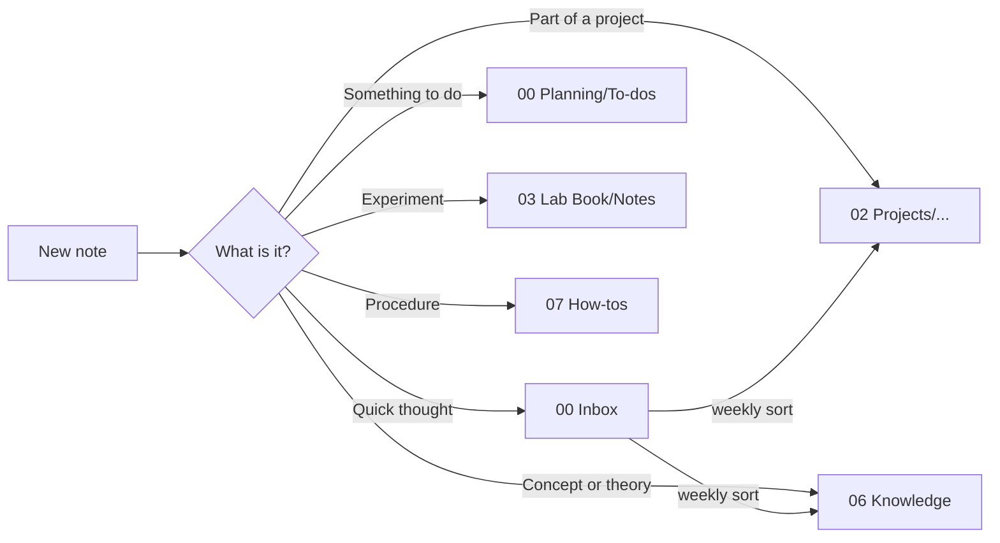
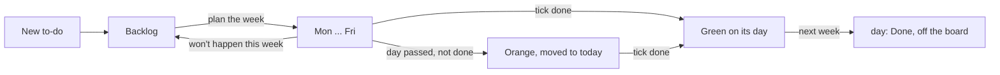
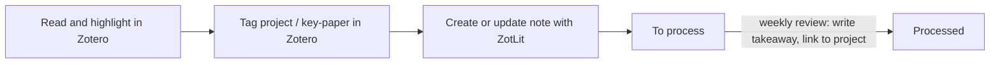

# Vault spec

> [!focus] Read this first
> The everyday user guide is [[How my vault works]] (the **How it works** button on the homepage). This note is the technical source of truth for how this vault is organised and how it looks. Any future change (by me or by Claude) should follow it, and update it if a rule changes. Share this note at the start of a session about the vault.

## Principles

> [!tip] Designed for focus
> - **One place for everything.** Every note has exactly one home folder. Other places link to it.
> - **Fixed order.** Top-level folders are numbered so they never move around.
> - **Small focus.** The homepage shows at most 3 focus items, today's to-dos and what's overdue - never the whole backlog.
> - **Buttons over menus.** Common actions are one click on [[00 Home]].
> - **Data lives in properties.** Boards, lists and the homepage read note properties, so dragging a card or picking a value updates everything.
> - **Same colour = same meaning**, everywhere (see [[#Visual theme]]).

## Folder structure

| Folder | What goes here |
|---|---|
| `00 Home.md` | The homepage. Opens on startup via Notebook Navigator's homepage setting. |
| `00 Inbox/` | Quick captures and AI chats. Sort weekly. |
| `00 Planning/` | `To-dos/` (one note per to-do), `To-do board.base`, [[Weekly review]] and [[Shopping list]]. |
| `01 Daily Notes/` | Daily notes, by year. A log of the day, not a to-do list. |
| `02 Projects/` | One subfolder per project, each with a hub note. Plans, progress, decisions, paper drafts. |
| `03 Lab Book/` | `Notes/` = numbered lab entries (`0014 - Title`), plus `Lab book base.base`. |
| `04 Literature/` | `ZotLit Imports/` (one ZotLit note per paper, named by citekey; `ZotLit attachments/` holds highlight images) and the [[Literature]] hub. Key papers are tagged `key-paper` in Zotero. |
| `05 Chemicals/` | Chemical database notes and base. |
| `06 Knowledge/` | Concepts and theory, by topic subfolder. Index: [[Knowledge index]]. |
| `07 How-tos/` | Procedures and software tips, by topic subfolder. Index: [[How-tos index]]. |
| `08 Meetings/` | One folder per meeting series: the series hub (e.g. [[Weekly meetings]]) and its meeting notes. |
| `Extras/` | Templates, scripts, attachments. Managed partly by the lab kit; due to be replaced by a kit update. |
| `99 Archive/` | Anything finished or retired. Never deleted outright. |

> [!question] Project, Knowledge or How-to?
> - **Project** - notes about *doing* something with an end point.
> - **Knowledge** - notes about *what's true*; reusable across projects.
> - **How-to** - notes about *how to do a task*, step by step.
>
> A concept used by a project lives in Knowledge; the project hub links to it.

## Note types and properties

> [!warning] Property naming
> - `Status` (capital S, plain text, one value) is the **only** status property in the vault. Never create a lowercase `status`.
> - `kind` marks system notes: `project`, `todo`, `literature`, `meeting`, `review`, `hub`, `daily`, `guide`, `list`, `spec`. (Not `type` - that clashes with the lab book's `Type`.)
> - Exception: literature notes have no `Status`. Their state is the inline field `[takeaway:: ...]` (empty = to process), because ZotLit refreshes the properties on every update (see below).
> - Lab book properties keep the lab kit's names (`Type`, `Exp. Class`, `Plan date`, ...).

### Lab entry (`03 Lab Book/Notes`)
Created from the lab kit's *Lab Book Template* (numbering + title prompt).

| Property | Values |
|---|---|
| `Status` | `Planned` -> `Started` -> `Processing results` -> `Closed` |
| `Based on` | links to the papers (citekeys) the experiment builds on |
| `cssclasses` | includes `vt` |

Any link from a lab entry to a paper - in `Based on` or in the text - shows up on that paper's note under *Used in experiments*.

### Project hub (`02 Projects/<Project>/<Project>.md`)
The hub note has the same name as its folder (a Notebook Navigator folder note) - no exceptions, because paper notes link to projects by that name. The Zotero collection for the project (`Projects/<Project>`) has the same name too.

| Property | Values |
|---|---|
| `kind` | `project` |
| `Status` | `Active`, `Paused`, `Done` - picked with the inline selector under the title |
| `cssclasses` | `vt`, `project` |
| `goal` | inline field in the *Goal* box - one line, what finishing looks like |

Created with the **New project** button (template `Extras/Templates/Project hub.md`): asks for the name, makes `02 Projects/<Name>/` and the hub inside it. Every hub has the same layout:

| Section | What it shows |
|---|---|
| Status + buttons | no `# heading` (Obsidian's inline title is the title); Status selector; **New to-do** (`todo`) and **New note** (`project-note`) |
| *Goal* | `[goal:: ...]` - also shown on the project's card |
| *To-dos* | open to-dos whose `project` is this hub, overdue first, then by day |
| *Notes* | every note in the project folder (and subfolders), newest first |
| *Papers* | every paper in the Zotero collection `Projects/<Project>` **or** linking this hub, key papers first (&#9733;), with my reason from its *For my projects* line |
| *Done to-dos* | collapsed |
| `## Related` | links I add by hand (concepts, how-tos); anything else project-specific goes below it |

**New note in a project** (`Extras/Templates/New project note.md`) files the note in the project's folder: the folder of the card it was pressed on, else the project you're in, else it asks which project. Then it asks for the title.

### Projects overview ([[Projects overview]], `02 Projects`)
**New project** button, then **one card per project** (two per row, Active first), then **Key papers by project** (from `Collections`, so a paper in several projects appears under each, with its takeaway). Homepage button **Projects** (`go-projects`).

Each card shows: name + status badge, the goal, the next 3 open to-dos (overdue first, "+ N more"), counts of open to-dos / papers / notes, and three buttons - **New note** (straight into that project's folder), **New to-do**, **Open**.

> [!note] The cards are DataviewJS
> Meta Bind buttons can't be generated per project, so the cards are drawn by a `dataviewjs` block (Dataview > *Enable JavaScript queries* must be on) and styled by section 10 of `vault-theme.css`. Their buttons run the Templater templates directly. This is the one place buttons aren't Meta Bind button templates.

### To-do (`00 Planning/To-dos`)
Created with the **New to-do** button / `Ctrl+Shift+T` (template `Extras/Templates/To-do.md`), or **New** at the top of a column on the board. A Templater **folder template** (`00 Planning/To-dos` -> `To-do.md`) runs the template for board cards too, and the template keeps the column's `day` (anything else starts in `Backlog`).

| Property | Values | Set by |
|---|---|---|
| `kind` | `todo` | template |
| `day` | `Backlog`, `Mon`, `Tue`, `Wed`, `Thu`, `Fri` (`Done` = finished in an earlier week, off the board) | dragging the card |
| `done` | tick box - finished | me |
| `planned` | date the card was put on its day | roll-over script |
| `rolled` | tick box - carried over from an earlier day (orange card) | roll-over script |
| `done_on` | date `done` was ticked | roll-over script |
| `project` | link to a project hub, e.g. `"[[Flow rig]]"`, or empty | template / me |
| `due` | date (`YYYY-MM-DD`), optional - only for real deadlines | me |
| `meeting` | tick box - raise this at the next Thursday meeting | me |

The template always files the to-do in `00 Planning/To-dos`, wherever it was started from. It fills in `project` by itself when started from a project card on [[Projects overview]], from a project hub, or from any note inside a project folder; otherwise it asks (Esc = no project). New to-dos get `cssclasses: [vt]`.

**Roll-over** (`Extras/Templates/Actions/To-do roll-over.md`, a Templater **startup template**, so it runs whenever Obsidian opens and re-checks every 15 minutes):
- A card's day means *the first such weekday on or after `planned`*. So a card dragged onto Mon on a Friday waits for next Monday.
- Unfinished card whose day has passed -> moves to today's column (Mon at the weekend), `rolled: true`, shown **amber**.
- Ticked `done` (click the circle on the card) -> stays on its day, shown **green**, `done_on` stamped.
- Monday (first run of a new week) -> cards finished in an earlier week get `day: Done` and leave the board. They still count everywhere else (meeting note, daily note, hubs, archive).
- Dragging a card yourself stamps `planned` and clears `rolled`. Backlog cards never roll.
- No weekend column: weekend leftovers roll to Monday.
- The same script makes the circle on each card clickable, marks carried-over cards orange (`vt-rolled`), and marks today's column (`body[data-vt-today]`).
- Check it is running: today's column is blue. If not, Settings > Templater > Startup templates must list `To-do roll-over.md`; restart Obsidian.

### Literature note (`04 Literature/ZotLit Imports`)
Created by **ZotLit** (command *ZotLit: Create literature note*) from three Liquid templates in `Extras/Templates/ZotLit/`: `zotlit-note.liquid.md` (layout), `zotlit-content.liquid.md` (the managed region) and `zotlit-lititem.liquid.md` (one highlight). Refreshed with the **update-litnote** button, which runs *ZotLit: Update literature note*.

> [!warning] Only the managed region is rewritten
> ZotLit rewrites only what sits between `%%zt-managed%%` and `%%/zt-managed%%`, plus its own properties. The *Takeaway* box above it and *My notes* below it are never touched. Never write inside the markers.

**Note layout:** empty line - Takeaway box (`[takeaway:: ]`) - *For my projects* box - update button and PDF link - *managed region* - `## My notes`.

**For my projects** (`[!projects]` callout) is filled once, when the note is created: one line `- [[<Project>]]: ` for each Zotero collection under `Projects/` that the paper is in (or a placeholder line if none). I write after the colon how the paper helps that project. Updates don't touch this box.

**Which projects a paper belongs to** comes from the `Collections` property (e.g. `Projects/Flow rig`), refreshed from Zotero on every update. So a paper added to another project collection later shows on that hub after **Update literature note** - just without a reason until I add a line `- [[<Project>]]: why` to the box. A box line on its own (no collection) also counts.

**Managed region:** `## Key points`, `## To try`, `## Questions`, `## Other highlights` (each only if it has highlights), then collapsed `[!lab]` *Used in experiments* and `[!info]` *Abstract & related*. Each highlight appears once, as one line: text, *my Zotero comment*, Zotero tags as `#tags`, page link to the PDF, and a block ID (`^` + Zotero annotation key), so a lab entry can link one finding with `[[citekey#^key]]`.

**Properties** are set in Settings > ZotLit > Templates > Frontmatter (not in the template file):

| Property | Expression | Merge |
|---|---|---|
| `kind` | `"literature"` | Keep existing |
| `Type` | `"Literature Note" \| split: ","` | Keep existing |
| `Title` | `zt.title` | Replace |
| `aliases` | `zt.title \| split: "§§"` | Append arrays |
| `Year` | `zt.date.year` | Replace |
| `Authors` | `zt.authors \| join: ", "` | Replace |
| `Zotero Tags` | `zt.tags \| map: "name"` | Replace |
| `Collections` | `zt.collections \| collection_paths` | Replace |
| `citekey` | `zt.citationKey` | Replace |
| `URL` | `zt.url` | Keep existing |
| `imported` | `"now" \| date: "%Y-%m-%d"` | Keep existing |
| `cssclasses` | `"vt,literature,wide" \| split: ","` | Keep existing |

`zotero-key` is added by ZotLit itself and marks the note as a literature note. `imported` is the date the note was first created (queries fall back to `file.ctime`).

| Field | Where | Meaning |
|---|---|---|
| `Zotero Tags` | properties | `key-paper` and topic tags, set **in Zotero** |
| `takeaway` | inline field in the Takeaway box | one line in my own words - what the paper says; empty = still *to process* |
| project lines | *For my projects* box | why it matters to each project |

> [!tip] Organising papers - two separate decisions, both in Zotero
> - **Which project?** Put the paper in a collection under `Projects/` (it can be in several).
> - **Is it important?** Tag it `key-paper`.
> Projects are no longer Zotero *tags*.

Highlight colours (set in Zotero, keys `1` `2` `3` in Zotero's colour order): **yellow** `1` key point (-> Key points), **red** `2` (or magenta) disagree / confused / question (-> Questions), **green** `3` method or idea to try (-> To try; green = lab in the palette). Any other colour -> Other highlights. Zotero can't reorder its colours, so the meanings follow its key order. A Zotero **comment** on a highlight is my own words; a Zotero **tag** on a highlight becomes a `#tag`.

### Shopping list ([[Shopping list]], `00 Planning`)
Lab orders only - one list of plain checkboxes, the one place checkboxes are used instead of to-do notes, because items are ordered, not planned. **Add to shopping** (homepage, `Extras/Templates/Actions/Add to shopping list.md`) asks for items (comma-separated) and adds them to the end; **Clear ticked** (Meta Bind `regexpReplaceInNote`) removes ticked items.

### Inbox (`00 Inbox`)
Everything captured quickly lands here (`Ctrl+N`, **Quick capture**). The homepage shows the count under *This week* with a **Sort inbox** button; the weekly review has the same button.

**Sort inbox** (`Extras/Templates/Actions/Sort inbox.md`, run by Meta Bind `runTemplaterFile`) opens each inbox note in turn and asks where it goes:

| Choice | What happens |
|---|---|
| To-do | becomes a to-do (`kind: todo`, `day: Backlog`) in `00 Planning/To-dos` |
| Project... | moved into the chosen project's folder |
| Knowledge... / How-to... / Meetings... | moved into a chosen subfolder (or a new one) |
| Archive | moved to `99 Archive/Inbox` |
| Delete | asks to confirm, then sends it to the trash |
| Skip / Stop (Esc) | leaves it / ends the run |

Every move offers a rename first and goes through Obsidian, so links update.

### Weekly meeting (`08 Meetings/Weekly meetings`)
`YYYY-MM-DD Weekly meeting`, created by **New meeting note** for the coming Thursday. Properties: `kind: meeting`, `date`. It fills itself with the 7 days before `date`: experiments edited, to-dos ticked done (`done_on`), papers imported, and open to-dos flagged `meeting`.

The deck is **one rolling PowerPoint per term** on Google Drive (newest week's slides first). The **Thursday deck** button works on Windows and Mac: it runs `Extras/Templates/Actions/Open Thursday deck.md`, which picks `deck_windows` or `deck_mac` from the [[Weekly meetings]] note and opens the file through Google Drive for desktop. Update both paths at the start of each term.

### Weekly review ([[Weekly review]])
Friday, 15 minutes: inbox, close experiments, plan next week, process one paper, Thursday prep, and on the first Friday of the month archive to-dos finished more than 30 days ago (button; uses `done_on`, moves them to `99 Archive/To-dos`).

### Daily note (`01 Daily Notes/YYYY/YYYY-MM-DD`)
Template: `Extras/Templates/Daily note.md`. Properties: `Type: Daily Note`, `kind: daily`, `Experiments`, `cssclasses: [vt]`.

| Section | What it shows |
|---|---|
| Buttons | **New to-do**, **To-do board** |
| *Planned for today* | open to-dos whose `day` matches that date's weekday, plus anything due on or before that date |
| *Notes* | free text - the log of the day |
| *Today in the vault* | lab entries edited, to-dos ticked done that day (`done_on`), papers imported on that date |

All queries use the note's **file name** as the date (`date(this.file.name)`), so a note made ahead of time from the calendar shows the right day. *Today in the vault* uses last-modified dates, so an entry edited again later moves to that later day.

> [!warning] Daily notes have no to-do checklist
> To-dos live on the board as notes. A checkbox in a daily note would not move anything on the board, so there would be two lists that disagree.

> [!tip] Every new daily note gets the template, whichever plugin creates it
> Notebook Navigator's calendar creates daily notes itself (not through the core Daily notes plugin). So the template is applied by **Templater folder templates**:
> - Settings > Templater > **Trigger Templater on new file creation**: on
> - **Folder templates**: `01 Daily Notes` -> `Extras/Templates/Daily note.md`
> - Notebook Navigator > Calendar: root folder `01 Daily Notes`, daily pattern `YYYY/YYYY-MM-DD`
>
> Templater only fills empty new files, so notes created by the core plugin are not filled twice. Templates use Templater syntax (`<% tp.file.title %>`), never core placeholders like `{{date}}`.

## Routines and shortcuts

| When | What |
|---|---|
| Every day | Homepage (`Alt+H`), focus 3 things, capture with `Ctrl+N` (lands in `00 Inbox`), new to-do `Ctrl+Shift+T` |
| Wednesday / Thursday | **New meeting note**, copy into the deck, flagged to-dos |
| Friday | [[Weekly review]] |
| First Friday of the month | Archive old to-dos (button in the weekly review) |

### Hotkeys

> [!tip] The modifier says *what*, the letter says *which thing*
> | Modifier | Means |
> |---|---|
> | `Alt` + letter | **Go to** something |
> | `Ctrl+Shift` + letter | **Make** something new |
> | `Alt+Shift` + letter | **Do something to this note** |
>
> Same letter = same thing: **H** home, **D** day, **T** to-do, **L** lab, **Z** Zotero paper, **F** find/fold.

| Keys | Command | Plugin |
|---|---|---|
| `Alt+H` | Open homepage | Notebook Navigator |
| `Alt+D` | Open today's daily note | Daily notes (core) |
| `Alt+F` | Search | Omnisearch |
| `Alt+Z` | Open a literature note | ZotLit |
| `Ctrl+N` | Quick capture (new note in `00 Inbox`) | core (default) |
| `Ctrl+Shift+T` | New to-do | Templater (`To-do.md`) |
| `Ctrl+Shift+L` | New lab entry | Templater (Lab Book Template) |
| `Ctrl+Shift+Z` | *not used* - it is Redo | core |
| `Alt+Shift+Z` | Update this literature note | ZotLit |
| `Alt+Shift+C` | Insert citation | ZotLit |
| `Alt+Shift+I` | Insert snippet | Templater (Lab Kit `Insert snippet.md`) |
| `Alt+Shift+F` / `Alt+Shift+U` | Fold all / unfold all | core |
| `Alt+Shift+↑` / `↓` | Move line up / down | core |
| `Alt+Shift+S` | Toggle source mode | core |
| `Alt+Shift+R` | Toggle canvas read-only | Advanced Canvas |
| `Ctrl+E` | Reading / editing | core (default) |

Rules: one key per command, no duplicates. Don't use `Ctrl+Alt` (it is AltGr on UK keyboards and types accented letters). Obsidian marks a clashing hotkey in red in Settings > Hotkeys. In Zotero: `1` `2` `3` pick the highlight colour (see [[#Literature note (`04 Literature/ZotLit Imports`)|Literature note]]).

## Visual theme

| Setting | Value |
|---|---|
| Base theme | Obsidian default |
| Font | Atkinson Hyperlegible Next (embedded in `vault-fonts.css`, works on phones) |
| Snippets | `vault-colours.css` - **the only file to edit for colour**: palette, text shades for light and dark mode, meanings, and dials (card fill, borders, tints, hint text). `vault-theme.css` - the look; it reads the names in `vault-colours.css` and sets no colours itself. `vault-fonts.css` - the font. `scrolling-mermaid.css` stays separate because the lab kit manages it. |
| Headings | H1 normal text, H2 amber, H3 blue, H4 green (red is kept for overdue) |
| Links | internal blue, external purple, amber on hover; plain text inside `vt` cards |
| Reading | every note 1200px wide (set in `vault-theme.css`, no class needed), line height 1.7, cursor line tinted blue |
| Icons | Lucide names only (same set as Obsidian and Meta Bind) |

> [!note] Palette - same colour, same meaning
> | Colour | RGB | Means | Used for |
> |---|---|---|---|
> | Blue | `59, 130, 246` | doing now | `[!focus]`, `Started`, today's column on the board |
> | Purple | `139, 92, 246` | projects | `[!projects]`, project hubs |
> | Amber | `245, 158, 11` | planning, waiting | `[!planning]`, `Processing results`, carried-over to-dos |
> | Green | `16, 185, 129` | lab, finished | `[!lab]`, `Closed`, done to-dos |
> | Slate | `100, 116, 139` | not started, navigation | `[!goto]`, `Planned`, `Backlog` |
> | Red | `239, 68, 68` | overdue **only** | `[!overdue]` |

**Boards** use Obsidian's **built-in kanban** view in Bases (Bases Board is no longer used - it didn't keep empty columns). Column order is `groupOrder` in the `.base` file. Colours come from section 11 of `vault-theme.css`, **by column name**: the To-do roll-over script writes each column's name into `data-vt-group`, so board colours need that script running, and renaming a column value means updating section 11. View names (`Board`) still matter for the to-do cards.
- Experiments: `Planned` slate, `Started` blue, `Processing results` amber, `Closed` green. Closed entries leave the board after 30 days.
- To-dos: `Backlog` slate; Mon-Fri alternate two neutral shades so the days read as separate bands; **today's column blue**. Cards: **green** = done, **amber** = carried over.

**To-do cards** show only the title and `done` (view `order:` in `To-do board.base`) - every extra property makes every card taller.
- The title wraps onto up to 3 lines, then "...". The tick circle sits top right; **clicking it ticks `done`** (the roll-over script handles the click, because Bases cards are read-only). Clicking anywhere else opens the note.
- Cards are a **fixed 88px**: Bases works out card heights itself and places each part with inline styles (`top`, `height`), so the CSS overrides those with `!important` rather than changing the height.
- Card HTML, for future CSS: `.bases-kanban-card` > `.bases-kanban-card-property.mod-title[data-property="file.name"]` and `.bases-kanban-card-property[data-property="note.done"]`, each with a `.bases-kanban-card-label` and `.bases-kanban-card-line`. A ticked box renders an `input:checked`.
- Green comes from `done` in the card; amber from a `vt-rolled` class the script adds (no `rolled` row needed on the card).

**Vault callouts** (defined in `vault-theme.css`): `[!focus]`, `[!projects]`, `[!planning]`, `[!lab]`, `[!goto]`, `[!overdue]`, `[!summary]`, `[!question]`, `[!comment]`, and `[!columns]` (the callouts inside it sit side by side, **at most 2 per row**, equal height). Standard Obsidian callouts (`note`, `tip`, `warning`, ...) are fine in ordinary notes.

**The vault look** comes from the `vt` css class. Every note made by a template or script gets `cssclasses: [vt]`: homepage, hubs, meetings, review, literature and lab notes.

## Homepage ([[00 Home]])

1. Date heading, with **How it works** at the right-hand end - opens [[How my vault works]]
2. Action buttons: Today's note, New to-do, New lab entry, Quick capture, Add to shopping, Search
3. Go to: To-do board, Experiments, Projects, Literature, Chemicals, Knowledge, How-tos, Meetings, Thursday deck, Weekly review, Shopping list
4. Today's focus - 3 slots side by side, Clear for tomorrow
5. Four cards, two per row: **This week** (open to-dos: overdue first, then by day; today's are tagged, carried-over ones tagged amber; inbox count at the bottom) - **Experiments on the go** / **Projects** - **Recently read** (last 5 imports, processed or to process)

> [!note] The vault look (homepage and every `vt` note)
> - Flat cards: one neutral border, rounded corners, quiet grey title with a faint icon. The **only** coloured card border is Today's focus (blue).
> - Lists are plain rows with dividers - no bullets, no tables.
> - Colour appears only in **status badges** (`vt-badge` + `vt-<status>` classes in `vault-theme.css`), using the palette above.
> - Buttons are separate outlined pills, all neutral.
> - Opens in **Reading view** (`obsidianUIMode: preview`, via the Force note view mode plugin). Press `Ctrl+E` to edit.

> [!tip] Button templates (Settings > Meta Bind > Button templates)
> | id | Label | Action |
> |---|---|---|
> | `go-projects` | Projects | open `[[Projects overview]]` |
> | `new-project` | New project | `templaterCreateNote` - `Extras/Templates/Project hub.md`, folder `02 Projects` |
> | `project-note` | New note | `templaterCreateNote` - `Extras/Templates/New project note.md`, folder `02 Projects` |

## Plugins and their jobs

| Plugin | Job |
|---|---|
| Notebook Navigator | Sidebar, folder notes, homepage on startup |
| Force note view mode | Opens notes with `obsidianUIMode: preview` in Reading view (homepage) |
| Meta Bind | Buttons (as button templates) and inputs (homepage, hub status) |
| Dataview | Lists on the homepage, hubs, meetings, review, daily notes and indexes |
| Bases (core) | Tables and the built-in kanban boards (experiments, to-dos) |
| Templater | Lab book, to-do, meeting templates; scripts (archive, sort inbox, shopping); **startup template** `To-do roll-over.md`; folder templates for `01 Daily Notes`, `00 Planning/To-dos`, `03 Lab Book/Notes`, `05 Chemicals/Chemicals`; user script `Extras/scripts/templater/vault/vtAsk.js` (the text box) |
| Lab kit | Lab entries, snippets, hazards, calculations |
| ZotLit (+ ZotLit Companion in Zotero) | Literature notes in `04 Literature/ZotLit Imports`, live annotation updates, citations. Template folder `Extras/Templates/ZotLit` |
| Omnisearch | Search |

## Rules for changes

> [!warning] Before changing anything
> - **Move and rename inside Obsidian or with the Obsidian CLI**, never in File Explorer - links only update that way.
> - Scripts run as a **dry run by default** and only change things with `-Run`. Back up the vault first.
> - Scripts are plain ASCII (Windows PowerShell 5.1 misreads anything else) and never overwrite an existing note without asking.
> - One-line PowerShell commands only when pasting (multi-line pastes trigger a warning).
> - Anything that has to be set up on **each computer** (apps, Zotero add-ons and settings, per-machine paths) is listed in [[Setting up a computer]] (`07 How-tos/Obsidian`). Add to it whenever such a setting is introduced.
> - Buttons never contain file paths. Anything that differs between Windows and Mac is a property on a note (e.g. `deck_windows` / `deck_mac`), read by a small Templater script.
> - Buttons are **Meta Bind button templates** (Settings > Meta Bind > Button templates). Notes show them with inline `BUTTON[id]` - no button code blocks in notes. (Exception: the project cards on [[Projects overview]].)
> - No commas or apostrophes in Meta Bind arguments (e.g. placeholders) - they break the parser.
> - Folder names: no apostrophes or `&`.
> - When a workflow changes, update **both** this spec and the user guide [[How my vault works]].
> - Every note is **wide** by default (`vault-theme.css`). Don't add a `wide` class to new templates; existing ones that have it are harmless.
> - Templates never add a `# heading` that repeats the file name - Obsidian's inline title already shows it. (A heading with *different* text, like the weekly meeting's date line, is fine.)
> - Every template starts with **an empty line** (straight after the properties, or at the very top if it has none), so the cursor lands there and doesn't open the first callout or block into edit mode.
> - Templates use Templater syntax only - except ZotLit's templates, which must be Liquid and live directly in `Extras/Templates/ZotLit/`. A folder that gets new notes from more than one place (e.g. daily notes) gets a Templater **folder template**.
> - Lab kit files (templates, scripts) are changed in the kit's own repo, so a kit update doesn't undo the change.
> - Templates ask for text with `tp.user.vtAsk(tp, "Placeholder")` - never `tp.system.prompt` - so every box looks like the pickers. Lists to choose from use `tp.system.suggester`. My user scripts live in `Extras/scripts/templater/vault/` (the kit owns `lab-kit/`).
> - Templates that a board can create (folder templates) keep any `day` / `Status` the board already wrote, unless the default is intended (lab entries always start `Planned`).

## Changelog
- 2026-10-07 - First kit version.
