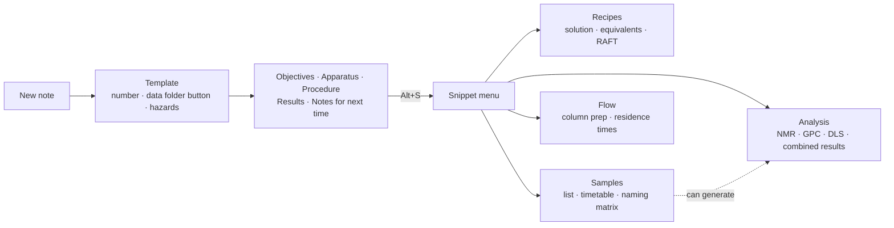
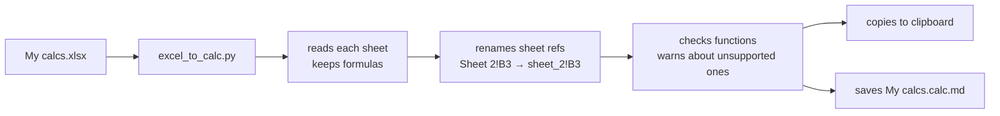

---
cssclasses:
  - academia
  - academia-rounded
  - scrolling_mermaid
---
# 🧰 Lab notebook kit: tutorial

> [!summary] The kit in one minute
> 1. **New note** in your Notes folder → name it → it's numbered and gets a hazard table, a data-folder button and five sections.
> 2. While writing, press **Alt+S** → pick a snippet → fill **one form** → a ready-made table appears.
> 3. Tables in ```` ```calc ```` blocks **calculate live**: click a cell to type, they update everything that depends on them.



---

## 1. Starting an experiment

1. Create a new note in **Notes**.
2. Type the title in the box that pops up (e.g. `Batch esterification of PABTC`).
3. You get `0016 - Batch esterification of PABTC` with:
   - 📁 **Open data folder**: opens `<your data folder>/0016 - …` (made when you press the button; set the data folder in Settings → Lab Kit)
   - ⚠️ **Hazards**: fills in once you add chemicals to the **Chemicals** property
   - **Objectives · Apparatus · Procedure · Results / Analysis · Notes for next time**

> [!tip] Add chemicals early
> Put them in **Chemicals** as links (`[[DCM]]`). The hazard table, and the reagent lists in snippets, all start from this property.

---

## 2. Snippets (Alt+S)

Put your cursor where you want the table, press **Alt+S**, type a few letters to filter, press Enter. Each snippet opens **one form**; press **Enter** to insert or **Esc** to cancel. Forms start empty (grey placeholders show what to type), and submitting an untouched form inserts nothing.

> [!note] One-time setup for Alt+S
> Snippets need [Templater](https://github.com/SilentVoid13/Templater). Install the kit files first (see section 7), then:
> 1. Templater → **Template hotkeys** → add `Insert snippet.md`. In a new vault the kit puts it in a **Lab Kit** folder inside your Templater templates folder (Settings → Lab Kit → **Manage files…** shows where each file is).
> 2. Obsidian → **Hotkeys** → search for *Insert snippet* (Templater lists it as "Templater: Insert …Insert snippet.md") → set **Alt+S**.
> 3. Templater → **User script functions** folder = the folder that holds `labSnippets.js` (a new vault gets a `lab-kit` folder inside your scripts folder; Templater also reads subfolders, so the folder above it works too). See Troubleshooting.
>
> Set **Settings → Lab Kit → Initials** too: the sample codes use them (`ABC0016-A`). Until then they use `XX` and a notice says so.

| Snippet | Use it for | Gives you |
|---|---|---|
| **Solution prep** | Making up a stock solution | Reagent · MW (from the chemical note) · target · added · mmol · wt% |
| **Recipe by equivalents** | Planning amounts from eq. | Eq. *relative to* any reagent, solvent "rest" row, total mass, wt% |
| **RAFT recipe generator** | RAFT / PISA | Monomer mass, DP, CTA:I, solids → every mass, solvent, Mn (several monomers: the mol fractions always add up) |
| **Variant naming matrix** | A grid of conditions | `ABC0016-A`, `-B`… · **Copy** gives one column for Excel |
| **Sample list** | Samples without times | Typed or generated codes · can add NMR/GPC/DLS + results |
| **Sampling timetable** | Kinetics | Codes per time point, **target clock times** from a start time · can add NMR/GPC/DLS + results |
| **NMR samples** | NMR submissions | Sample · solvent · method · conversion · dataset · checklist · tags the note `NMR` |
| **GPC samples** | GPC | Sample · eluent · Mn · Mw · Đ (calculated) · tags `GPC` |
| **DLS samples** | DLS | Sample · solvent · temperature · Dh · PDI · tags `DLS` |
| **Combined results** | Pulling it together | One row per sample with conversion, Mn, Mw, Đ, Dh, PDI |
| **Flow column prep** | Packing a column | Weighings (and the packing material) → bead mass → reactor volume |
| **Residence times** | Flow rates | Flow for each residence time (+ optional check of flow rates) |
| **Blank calc table** | Anything else | Your own columns |

> [!example] A typical analysis workflow
> 1. **Sampling timetable** → times `0, 30, 60, 120`, letters `A, B`, start `10:30`, tick **NMR** and **Combined results**.
> 2. On the day, type the real times in **Taken at**.
> 3. Type conversions into the **NMR** table: the **Results** table fills itself in.
> 4. **Copy** on the Results table → paste into Excel or Origin.

> [!tip] Several sample tables
> The NMR / GPC / DLS / Results snippets take sample codes from `samples`, `samples2`, `samples3`… and combine them. The Results table links every `nmr`, `nmr2`… table.

---

## 3. Calc tables

### 3.1 Reading a table
| Colour | Meaning |
|---|---|
| plain | a value you typed |
| 🟦 blue | calculated by a formula |
| 🟧 amber text, "needs MW · DMAm" | can't be calculated yet: it tells you which input is missing |
| 🟧 amber outline on an empty cell | this is an input something is waiting for |
| 🟥 red | a real problem (hover it for the reason) |

### 3.2 Editing
| To… | Do this |
|---|---|
| change a value **or a formula** | **click the cell**, type, **Enter** or **Tab** to save, **Esc** to throw away what you typed (clicking another cell while one is open currently needs a second click) |
| add a row | **+ Row** (adds above *Total* / *(rest)* rows, copies the formulas down) |
| insert or delete a specific row | **right-click** the row |
| see cell addresses | **A1** |
| send to Excel | **Copy** |
| change options or lots of text | hover → Obsidian's `</>` button (top right), or arrow into the block |

> [!note] Rows and references
> Like Excel: when you add a row, `SUM(B2:B4)` becomes `SUM(B2:B5)`, and other tables pointing into this one (`sol1!B5`, `XLOOKUP(…, nmr!B$2:B$4, …)`) are updated too. Deleting a row that something points at gives `#REF!`.

> [!warning] Give every table its own name
> If two `calc` tables in a note have the same `name:`, both show a red "⚠ name used twice". Any reference to that name shows `#REF!` until you rename one.

### 3.3 Writing formulas
Formulas start with an equals sign (=) and use **Excel syntax**. Row 1 is the header row, so the first data row is row 2. The examples below are shown without the leading = (type it in the cell).

- Same table: `C2*D2/1000`
- Another table in the note: give it a `name:` and use `sol1!D2` or `SUM(sol1!D2:D4)`
- Molar mass from a chemical note: `MW(A2)` (reads an `MW`, `Mw` or `Molar mass` property; the cell can hold `[[DCM]]` or `DCM`)
- Any property: `PROP("PABTC", "Density")`
- Typing `[[` in a cell suggests your chemical notes once **Chemical folder** is set (section 6)
- Lookups: `XLOOKUP(A2, nmr!B$2:B$9, nmr!E$2:E$9, "")`
- Clock time: `CLOCK("10:30", 90)` → `12:00`

Residence time, as used in the flow snippets:
$$\tau = \frac{V_{\text{reactor}}}{Q} \qquad Q = \frac{V_{\text{reactor}}}{\tau}$$

> [!info]- All functions
> `SUM AVERAGE MIN MAX COUNT COUNTA PRODUCT SUMPRODUCT ROUND ROUNDUP ROUNDDOWN INT ABS SQRT POWER EXP LN LOG LOG10 MOD PI IF IFERROR AND OR NOT CONCAT MATCH INDEX XLOOKUP CLOCK MW PROP`

> [!info]- Block options (lines above the table)
> | Option | Example | Does |
> |---|---|---|
> | `name:` | `name: sol1` | lets other tables use this one |
> | `title:` | `title: Solution 1` | caption |
> | `icon:` | `icon: flask-round` | caption icon, any name from lucide.dev |
> | `decimals:` | `decimals: 3` | fixed decimals |
> | `sig:` | `sig: 4` | significant figures for small numbers |
> | `grid:` | `grid: true` | start with A1 labels shown |
> | `copy:` | `copy: list` / `copy: column A` | what **Copy** puts on the clipboard |

---

## 4. Hazards
The table lists every chemical in **Chemicals**, worst first, with each H-code coloured by severity. It needs each chemical note to have an `H_Phrase` list property. It shows one row per chemical with a chip per H-code (hover for the full phrase); Settings → Lab Kit → Hazards → Layout switches to the two-column table. It only redraws when this note's Chemicals or a linked chemical note changes. The header is a ```` ```lab-header ```` block; **Insert lab header block** in the command palette adds one.

All the options are in Settings → Lab Kit → Hazards. To change one for a single note, put it inside the block, one per line:

````
```lab-header
layout: table
collapsed: false
showLegend: false
```
````

| Option | Values | Default |
|---|---|---|
| `layout` | `chips` or `table` | `chips` |
| `chemicalsProperty` · `classProperty` | property names | `Chemicals` · `Exp. Class` |
| `hideForClasses` | comma-separated classes | `in-silico, setup` |
| `collapsed` | hazards behind a one-line summary | `true` |
| `startOpen` | summary starts expanded | `true` |
| `showSummaryCounts` | "Severe 1 · High 2" in the summary | `true` |
| `showLegend` · `legendDetails` | colour key, with categories | `true` · `false` |
| `sortByWorstHazard` | off = A to Z | `true` |
| `highlightWholePhrase` | colour the whole phrase, not just the code | `false` |
| `showCategoryLabels` | "Cat 2" after each code | `false` |
| `shadeChemicalCell` · `centreChemicalCell` | shade / centre the name | `true` · `true` |
| `showMissing` | list chemicals with no note or no `H_Phrase` | `true` |
| `dataFolder` · `hazards` | `false` leaves out the button / the hazards | `true` |

---

## 5. Excel → calc tables (the Python script)

> [!question] What does it do?
> It reads an Excel file, takes every cell (values **and formulas**) and writes them out as ```` ```calc ```` blocks. Each sheet becomes one block named after the sheet, so `Recipe!B5` in Excel becomes `recipe!B5` and still works in Obsidian.



**One-time setup**
1. Install Python from python.org (tick **Add python.exe to PATH**).
2. Open **Terminal** (or Command Prompt) and run: `pip install openpyxl`

**Each time**
1. In File Explorer, go to the folder with your Excel file.
2. Click the address bar, type `cmd`, press Enter. A terminal opens in that folder.
3. Run (change the path to where your vault is):
   ```
   py "C:\path\to\vault\Extras\scripts\excel_to_calc.py" "My calcs.xlsx"
   ```
4. Paste into your note (**Ctrl+V**). The result is already on the clipboard.

| Option | Example | Does |
|---|---|---|
| `--sheet` | `--sheet Recipe` | only this sheet (repeat for more) |
| `--range` | `--range A1:G8` | only these cells (one sheet) |
| `--name` | `--name recipe` | the block's name (one sheet) |

> [!warning]
> - Google Sheets: **File → Download → Microsoft Excel (.xlsx)** first.
> - Excel shows `15%` but stores `0.15`. Check percentage cells.
> - Functions Lab Kit doesn't know are listed as warnings; those cells show `#NAME?` until you rewrite them.

---

## 6. Customising

| Change | Where |
|---|---|
| Your initials in sample codes | Settings → Lab Kit → Initials (empty until you set it; snippets use `XX` and say so) |
| Your chemical notes | Settings → Lab Kit → Chemical folder (empty = no suggestions). Typing `[[` in a calc cell, and the reagent / solvent fields of the Alt+S forms, then suggest the notes in it by file name or by their **Names** property (a list or one value). Picking a name found through **Names** inserts `[[Note\|name]]`. In a form, **Enter** picks the highlighted suggestion; Enter again inserts |
| Which property holds the molecular weight | Settings → Lab Kit → Molecular weight property (empty = MW, Mr, Molecular weight and similar are tried) |
| Data folder (e.g. on Google Drive) | Settings → Lab Kit → Data folder root (empty until you set it) |
| A snippet's menu icon | Settings → Lab Kit → Snippet menu (a Lucide icon name; empty keeps the built-in one) |
| A snippet's built-in icon or text | first two lines of its file in the `Snippets` folder next to `Insert snippet.md` (`// icon:` and `// desc:`) |
| What a snippet builds | `labSnippets.js` in your Templater user scripts folder (one section per snippet) |
| A new snippet | copy a file in the `Snippets` folder, give it a new number and name |
| Leave a snippet out of the Alt+S menu | Settings → Lab Kit → **Manage files…** → switch its **Use** toggle off (see section 7) |

> [!tip] Icons
> Browse [lucide.dev](https://lucide.dev/icons) and use the icon's name, e.g. `flask-round`, `test-tube`, `beaker`, `atom`, `droplets`. A comma-separated list tries each name in turn.

---

## 7. Updating the kit

The kit files (templates, scripts, CSS snippet) are built into the plugin, so this works on desktop and mobile. It needs Obsidian 1.13 or newer. **Settings → Lab Kit → Built-in kit**:

| Button | Does |
|---|---|
| **Review update…** | a preview of every file: new, updated, changed by you, missing. Nothing is written until you press **Apply** |
| **Update all safe files** | adds new files and updates the ones you never edited (the first install asks first). It never merges |
| **Set up** (Templater row) | points Templater's user scripts folder at the kit's scripts (only when it can't find them now), fills in its template folder only when that is empty (one you set is never changed), and adds *Insert snippet* to its Template hotkeys. Press it once after installing the kit, then set **Alt+S** in Obsidian → Hotkeys. Installing or updating the Alt+S menu template adds the hotkey entry by itself |
| **Manage files…** | every kit file with a status, and buttons to update, restore the kit's original, detach / re-attach or open it one file at a time. It also has a switch for the kit's CSS snippet |

- **Backups:** every file an update replaces is copied to the Backup folder first. The Templates, Scripts and Backup folders are settings (empty = detected).
- **A file you changed** is never overwritten. If your edits and the kit's touch different lines, it is listed under "merges cleanly" and you can tick it to merge. In the Lab Book template the properties are merged one by one, so a property you added stays.
- **Conflict:** if you and the kit changed the same lines, the file shows **Conflict** and is left alone. Press **Resolve…**, choose for each change whether to keep yours, take the kit's, keep both or edit it, check the preview and press **Apply**. **Keep all mine** and **Take kit version** settle the whole file at once.
- **Use toggle:** each snippet, and the Excel converter `excel_to_calc.py`, has a switch in **Manage files…**, with a one-line description. Off = not installed and not in the Alt+S menu. Switching off a snippet you already have asks first, copies it to the Backup folder and moves it to your trash. Switching it on installs it again. **Update all safe files** never installs a switched-off snippet.
- **Retired:** if a later kit stops shipping a file you installed, it is listed as **Retired**. It stays in your vault; **Forget** stops listing it.
- **First install:** the question before the first install has two switches, both on: **Turn on the CSS snippet**, and **Set Templater's user scripts folder** (only shown when Templater has no such folder yet; a folder you already set is never changed).

The plugin itself (calc tables, header, windows) updates through Obsidian: **Settings → Community plugins → Check for updates**. A new plugin version brings the new kit with it, but your templates and scripts only change when you press **Apply** here. When Obsidian starts after such an update, a notice says **Lab kit vX is ready → Review**. Switch it off with **Settings → Lab Kit → Tell me when a kit update is ready**.

After an update, a **What's new** popup opens once. Open it again from **Settings → Lab Kit → What's new** or the command **Show what's new**.

> [!tip] Moving kit files
> Move or rename kit files **inside Obsidian** and the kit follows them. If you move them in File Explorer instead, the kit can't follow: they show as **Missing** in **Manage files…** until you move them back.

---

## 8. Troubleshooting

| Problem | Fix |
|---|---|
| Snippets ask one question at a time, or say "need Templater → User script functions" | Settings → Templater → **User script functions** folder = the folder that holds `labSnippets.js` |
| `#NOTE?` in an MW cell | No note with that name. Check spelling, or type the MW over the formula |
| `#PROP?` in an MW cell | The chemical note has no `MW` / `Mw` property |
| `#REF!` | The formula points at a deleted row or a table name that doesn't exist |
| Table looks like plain code | Lab Kit isn't enabled (Settings → Community plugins) |
| No update notice | It only shows when the plugin brings a newer kit than the one installed, and **Tell me when a kit update is ready** is on (Settings → Lab Kit). **Review update…** works any time |
| Hazard table empty | Chemicals property empty, or chemical notes missing `H_Phrase` |

Related: [Changelog](changelog.md)
