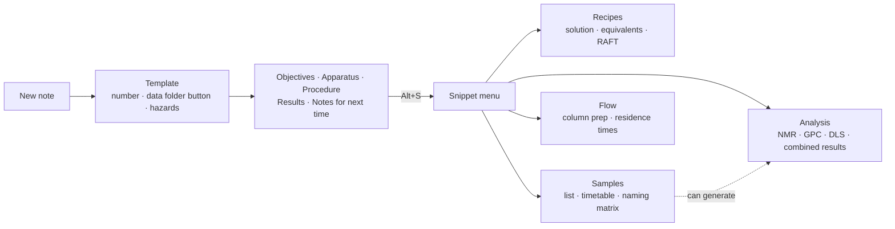
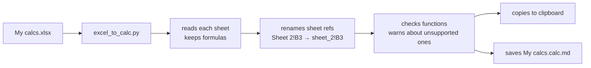

---
cssclasses:
  - academia
  - academia-rounded
  - scrolling_mermaid
---
# 🧰 Lab notebook kit: tutorial (v0.3)

> [!summary] The kit in one minute
> 1. **New note** in your Notes folder → name it → it's numbered and gets a hazard table, a data-folder button and five sections.
> 2. While writing, press **Alt+S** → pick a snippet → fill **one form** → a ready-made table appears.
> 3. Tables in ```` ```calc ```` blocks **calculate live**: click a cell to type, they update everything that depends on them.



---

## 1. Starting an experiment

1. Create a new note in **Notes**.
2. Type the title in the box that pops up (e.g. `Batch esterification of PABTC`).
3. You get `0016 - Batch esterification of PABTC` with:
   - 📁 **Open data folder**: opens `<your data folder>/0016 - …` (made when you press the button; set the data folder in Settings → Lab Kit)
   - ⚠️ **Hazards**: fills in once you add chemicals to the **Chemicals** property
   - **Objectives · Apparatus · Procedure · Results / Analysis · Notes for next time**

> [!tip] Add chemicals early
> Put them in **Chemicals** as links (`[[DCM]]`). The hazard table, and the reagent lists in snippets, all start from this property.

---

## 2. Snippets (Alt+S)

Put your cursor where you want the table, press **Alt+S**, type a few letters to filter, press Enter. Each snippet opens **one form**; press **Enter** to insert or **Esc** to cancel.

| Snippet | Use it for | Gives you |
|---|---|---|
| **Solution prep** | Making up a stock solution | Reagent · MW (from the chemical note) · target · added · mmol · wt% |
| **Recipe by equivalents** | Planning amounts from eq. | Eq. *relative to* any reagent, solvent "rest" row, total mass, wt% |
| **RAFT recipe generator** | RAFT / PISA | Monomer mass, DP, CTA:I, solids → every mass, solvent, Mn |
| **Variant naming matrix** | A grid of conditions | `ABC0016-A`, `-B`… · **Copy** gives one column for Excel |
| **Sample list** | Samples without times | Typed or generated codes · can add NMR/GPC/DLS + results |
| **Sampling timetable** | Kinetics | Codes per time point, **target clock times** from a start time · can add NMR/GPC/DLS + results |
| **NMR samples** | NMR submissions | Sample · solvent · method · conversion · dataset · checklist · tags the note `NMR` |
| **GPC samples** | GPC | Sample · eluent · Mn · Mw · Đ (calculated) · tags `GPC` |
| **DLS samples** | DLS | Sample · solvent · temperature · Dh · PDI · tags `DLS` |
| **Combined results** | Pulling it together | One row per sample with conversion, Mn, Mw, Đ, Dh, PDI |
| **Flow column prep** | Packing a column | Weighings → bead mass → reactor volume |
| **Residence times** | Flow rates | Flow for each residence time (+ optional check of flow rates) |
| **Blank calc table** | Anything else | Your own columns |

> [!example] A typical analysis workflow
> 1. **Sampling timetable** → times `0, 30, 60, 120`, letters `A, B`, start `10:30`, tick **NMR** and **Combined results**.
> 2. On the day, type the real times in **Taken at**.
> 3. Type conversions into the **NMR** table: the **Results** table fills itself in.
> 4. **Copy** on the Results table → paste into Excel or Origin.

---

## 3. Calc tables

### 3.1 Reading a table
| Colour | Meaning |
|---|---|
| plain | a value you typed |
| 🟦 blue | calculated by a formula |
| 🟧 amber text, "needs MW · DMAm" | can't be calculated yet: it tells you which input is missing |
| 🟧 amber outline on an empty cell | this is an input something is waiting for |
| 🟥 red | a real problem (hover it for the reason) |

### 3.2 Editing
| To… | Do this |
|---|---|
| change a value **or a formula** | **click the cell**, type, Enter (Esc cancels) |
| add a row | **+ Row** (adds above *Total* / *(rest)* rows, copies the formulas down) |
| insert or delete a specific row | **right-click** the row |
| see cell addresses | **A1** |
| send to Excel | **Copy** |
| change options or lots of text | hover → Obsidian's `</>` button (top right), or arrow into the block |

> [!note] Rows and references
> Like Excel: when you add a row, `SUM(B2:B4)` becomes `SUM(B2:B5)`, and other tables pointing into this one (`sol1!B5`, `XLOOKUP(…, nmr!B$2:B$4, …)`) are updated too. Deleting a row that something points at gives `#REF!`.

### 3.3 Writing formulas
Formulas start with an equals sign (=) and use **Excel syntax**. Row 1 is the header row, so the first data row is row 2. The examples below are shown without the leading = (type it in the cell).

- Same table: `C2*D2/1000`
- Another table in the note: give it a `name:` and use `sol1!D2` or `SUM(sol1!D2:D4)`
- Molar mass from a chemical note: `MW(A2)` (reads an `MW`, `Mw` or `Molar mass` property; the cell can hold `[[DCM]]` or `DCM`)
- Any property: `PROP("PABTC", "Density")`
- Lookups: `XLOOKUP(A2, nmr!B$2:B$9, nmr!E$2:E$9, "")`
- Clock time: `CLOCK("10:30", 90)` → `12:00`

Residence time, as used in the flow snippets:
$$\tau = \frac{V_{\text{reactor}}}{Q} \qquad Q = \frac{V_{\text{reactor}}}{\tau}$$

> [!info]- All functions
> `SUM AVERAGE MIN MAX COUNT COUNTA PRODUCT SUMPRODUCT ROUND ROUNDUP ROUNDDOWN INT ABS SQRT POWER EXP LN LOG LOG10 MOD PI IF IFERROR AND OR NOT CONCAT MATCH INDEX XLOOKUP CLOCK MW PROP`

> [!info]- Block options (lines above the table)
> | Option | Example | Does |
> |---|---|---|
> | `name:` | `name: sol1` | lets other tables use this one |
> | `title:` | `title: Solution 1` | caption |
> | `icon:` | `icon: flask-round` | caption icon, any name from lucide.dev |
> | `decimals:` | `decimals: 3` | fixed decimals |
> | `sig:` | `sig: 4` | significant figures for small numbers |
> | `grid:` | `grid: true` | start with A1 labels shown |
> | `copy:` | `copy: list` / `copy: column A` | what **Copy** puts on the clipboard |

---

## 4. Hazards
The table lists every chemical in **Chemicals**, worst first, with each H-code coloured by severity. It needs each chemical note to have an `H_Phrase` list property. It shows one row per chemical with a chip per H-code (hover for the full phrase); Settings → Lab Kit → Hazard layout switches to the two-column table. It only redraws when this note's Chemicals or a linked chemical note changes. The header is a ```` ```lab-header ```` block; **Insert lab header block** in the command palette adds one.

All the options are in Settings → Lab Kit → Hazards. To change one for a single note, put it inside the block, one per line:

````
```lab-header
layout: table
collapsed: false
showLegend: false
```
````

| Option | Values | Default |
|---|---|---|
| `layout` | `chips` or `table` | `chips` |
| `chemicalsProperty` · `classProperty` | property names | `Chemicals` · `Exp. Class` |
| `hideForClasses` | comma-separated classes | `in-silico, setup` |
| `collapsed` | hazards behind a one-line summary | `true` |
| `startOpen` | summary starts expanded | `true` |
| `showSummaryCounts` | "Severe 1 · High 2" in the summary | `true` |
| `showLegend` · `legendDetails` | colour key, with categories | `true` · `false` |
| `sortByWorstHazard` | off = A to Z | `true` |
| `highlightWholePhrase` | colour the whole phrase, not just the code | `false` |
| `showCategoryLabels` | "Cat 2" after each code | `false` |
| `shadeChemicalCell` · `centreChemicalCell` | shade / centre the name | `true` · `true` |
| `showMissing` | list chemicals with no note or no `H_Phrase` | `true` |
| `dataFolder` · `hazards` | `false` leaves out the button / the hazards | `true` |

---

## 5. Excel → calc tables (the Python script)

> [!question] What does it do?
> It reads an Excel file, takes every cell (values **and formulas**) and writes them out as ```` ```calc ```` blocks. Each sheet becomes one block named after the sheet, so `Recipe!B5` in Excel becomes `recipe!B5` and still works in Obsidian.



**One-time setup**
1. Install Python from python.org (tick **Add python.exe to PATH**).
2. Open **Terminal** (or Command Prompt) and run: `pip install openpyxl`

**Each time**
1. In File Explorer, go to the folder with your Excel file.
2. Click the address bar, type `cmd`, press Enter. A terminal opens in that folder.
3. Run (change the path to where your vault is):
   ```
   py "C:\path\to\vault\Extras\scripts\excel_to_calc.py" "My calcs.xlsx"
   ```
4. Paste into your note (**Ctrl+V**). The result is already on the clipboard.

| Option | Example | Does |
|---|---|---|
| `--sheet` | `--sheet Recipe` | only this sheet (repeat for more) |
| `--range` | `--range A1:G8` | only these cells (one sheet) |
| `--name` | `--name recipe` | the block's name (one sheet) |

> [!warning]
> - Google Sheets: **File → Download → Microsoft Excel (.xlsx)** first.
> - Excel shows `15%` but stores `0.15`. Check percentage cells.
> - Functions Lab Calc doesn't know are listed as warnings; those cells show `#NAME?` until you rewrite them.

---

## 6. Customising

| Change | Where |
|---|---|
| Your initials in sample codes | Settings → Lab Kit → Initials (empty until you set it; snippets use `XX` and say so) |
| Data folder (e.g. on Google Drive) | Settings → Lab Kit → Data folder root (empty until you set it) |
| A snippet's menu icon | Settings → Lab Kit → Snippet menu (a Lucide icon name; empty keeps the built-in one) |
| A snippet's built-in icon or text | first two lines of its file in `Templates/Snippets` (`// icon:` and `// desc:`) |
| What a snippet builds | `Extras/scripts/templater/labSnippets.js` (one section per snippet) |
| A new snippet | copy a file in `Templates/Snippets`, give it a new number and name |

> [!tip] Icons
> Browse [lucide.dev](https://lucide.dev/icons) and use the icon's name, e.g. `flask-round`, `test-tube`, `beaker`, `atom`, `droplets`. A comma-separated list tries each name in turn.

---

## 7. Updating the kit

The kit files are also built into the plugin: **Settings → Lab Kit → Built-in kit → Review update…** shows what would change (nothing is written until you press **Apply**), and **Update all safe files** adds new files and updates the ones you never edited. A file you changed yourself is left alone. Backups of replaced files go to the Backup folder set there. **Manage files…** lists every kit file with a status and lets you update, restore the kit's original, detach or open one file at a time, and switch the kit's CSS snippet on or off. If you and the kit changed the same lines of a file it shows **Conflict**: press **Resolve…**, choose for each change whether to keep yours, take the kit's, keep both or edit it, check the preview and press **Apply** (your copy is backed up first). The folder updater described below is the older way and still works.

New versions arrive in the update folder you set in **Settings → Lab Kit** (one subfolder per version). When Obsidian starts, a notice says **Lab kit vX is ready → Review & update**. You can also run **Lab Kit: Check for updates** from the command palette, or use **Settings → Lab Kit → Check now**.

The update window shows:
1. **Where things go**: detected from your vault; edit a line if it's wrong, then **Recheck**
2. **Changes**: new · replaced · *edited by you* (kept unless you tick *overwrite*) · removed · kept · unchanged
3. **Options**: set Templater's user script folder, turn on new CSS snippets

Then **Install**. `lab-config.json` is never overwritten. If you want copies of the files an update replaces, turn on **Back up replaced files** (in the update window or Settings → Lab Kit); they then go to `Extras/kit-backups/<date> before vX/`.

> [!tip] Moving kit files
> Move or rename kit files **inside Obsidian** and the updater follows them. If you move things in File Explorer instead, use **Settings → Lab Kit → Forget install record** and the next update re-detects everything.

---

## 8. Troubleshooting

| Problem | Fix |
|---|---|
| Snippets ask one question at a time, or say "need Templater → User script functions" | Settings → Templater → **User script functions** folder = `Extras/scripts/templater` |
| `#NOTE?` in an MW cell | No note with that name. Check spelling, or type the MW over the formula |
| `#PROP?` in an MW cell | The chemical note has no `MW` / `Mw` property |
| `#REF!` | The formula points at a deleted row or a table name that doesn't exist |
| Table looks like plain code | Lab Kit (Lab Calc) isn't enabled (Settings → Community plugins) |
| No update notice | Settings → Lab Kit: check the update folder path, then **Check now** |
| Hazard table empty | Chemicals property empty, or chemical notes missing `H_Phrase` |

Related: [[Lab notebook kit - update to v0.3]] · [[Lab notebook kit - changelog]]
